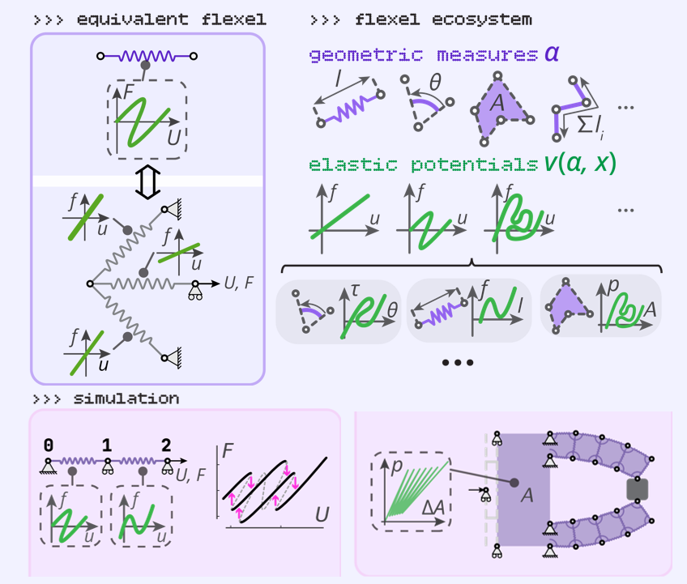

The `springable` Python library is an implementation of the **flexel framework**. This framework defines a method to define and solve mechanical systems composed of energy-storing entities called **flexels**.

## Flexel
A flexel (**flex**ible **el**ement) can be seen as the generalization of a nonlinear spring. In a nonlinear spring, the axial force is found in two steps: first, its length is calculated from the end nodes’ coordinates; then, that length is used in an energy potential whose derivative gives the force. A flexel extends this idea in two main ways.
First, it replaces the notion of length with a more general geometric measure (noted $\alpha$), which can be any scalar value computed from a list of nodes’ coordinates (noted $z_i$); for example, an angle, an area, a total path length, or the distance from a point to a line.
Second, it allows for a wider range of energy potentials, supporting tunable and possibly multi-valued force–displacement curves. These curves can have multiple turning points and intersections, allowing flexels to singlehandedly encode information about their loading history, or capture snapping or countersnapping phenomenona, for instance.

{ align=center height=320px }

The flexel's ability to capture highly nonlinear behaviors without resorting to an assembly of lower-level components stands in stark contrast with other finite element methods. The versatility of flexels to represent different shapes and behaviors allows to model stretch, compression, bending, pneumatic actuation, cable-driven systems, contact... or interacting of those! As all flexels rely on a single formulation, they form an ecosystem which allows to build simpler models, that are easier to solve, interpret and use to gain insight into the mechanics or guide the design process.

## The mathematical formulation, the equations and the algorithm
The complete theory, the algorithm and all the derived equations are available in the research paper that introduces the flexel framework. The full preprint is freely available [here](https://arxiv.org/abs/2510.19741) on arXiv. The mathematical formulation and equations are developed in the supplementary information section (second part of the PDF).

If `springable` or the **concept of flexel** has been useful for your work, your research or your projects, we strongly encourage you to cite our paper


> Ducarme, P., Weber, B., van Hecke, M., & Overvelde, J. T. B. (2025). *Flexel ecosystem: Simulating mechanical systems from entities with arbitrarily complex mechanical responses*. arXiv. [https://doi.org/10.48550/arXiv.2510.19741](https://doi.org/10.48550/arXiv.2510.19741)


```bib
@misc{ducarme_flexel_2025,
	title = {Flexel ecosystem: simulating mechanical systems from entities with arbitrarily complex mechanical responses},
	shorttitle = {Flexel ecosystem},
	url = {http://arxiv.org/abs/2510.19741},
	doi = {10.48550/arXiv.2510.19741},
	abstract = {Nonlinearities and instabilities in mechanical structures have shown great promise for embedding advanced functionalities. However, simulating structures subject to nonlinearities can be challenging due to the complexity of their behavior, such as large shape changes, effect of pre-tension, negative stiffness and instabilities. While traditional finite element analysis is capable of simulating a specific nonlinear structure quantitatively, it can be costly and cumbersome to use due to the high number of degrees of freedom involved. We propose a framework to facilitate the exploration of highly nonlinear structures under quasistatic conditions. In our framework, models are simplified by introducing `flexels', elements capable of intrinsically representing the complex mechanical responses of compound structures. By extending the concept of nonlinear springs, flexels can be characterized by multi-valued response curves, and model various mechanical deformations, interactions and stimuli, e.g., stretching, bending, contact, pneumatic actuation, and cable-driven actuation. We demonstrate that the versatility of the formulation allows to model and simulate, with just a few elements, complex mechanical systems such as pre-stressed tensegrities, tape spring mechanisms, interaction of buckled beams and pneumatic soft gripper actuated using a metafluid. With the implementation of the framework in an easy-to-use Python library, we believe that the flexel formulation will provide a useful modeling approach for understanding and designing nonlinear mechanical structures.},
	urldate = {2025-10-24},
	publisher = {arXiv},
	author = {Ducarme, Paul and Weber, Bart and Hecke, Martin van and Overvelde, Johannes T. B.},
	month = oct,
	year = {2025},
	note = {arXiv:2510.19741 [cond-mat]},
	keywords = {Condensed Matter - Soft Condensed Matter},
}
```

